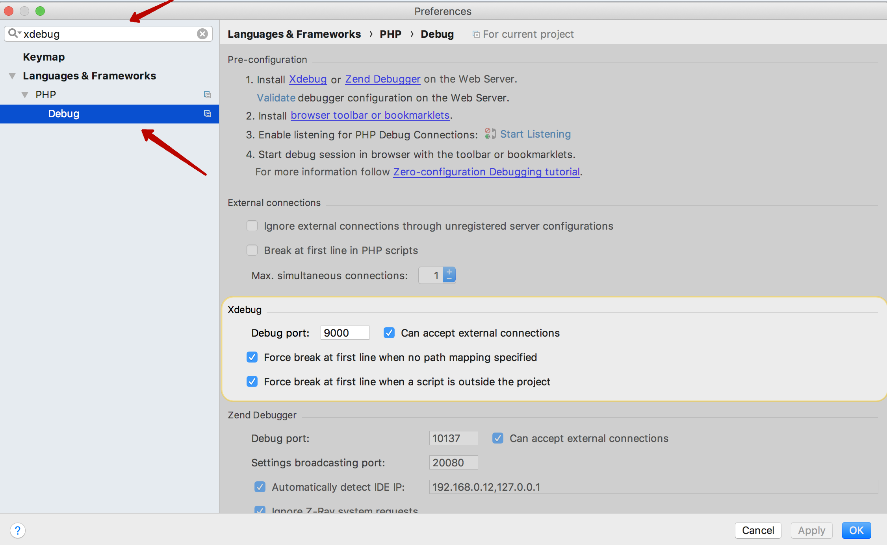
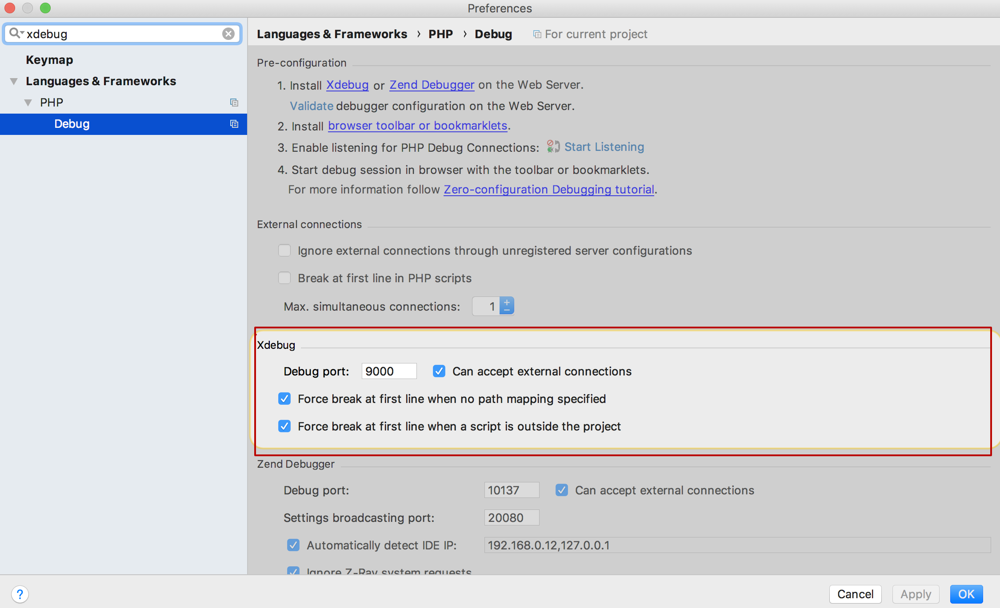
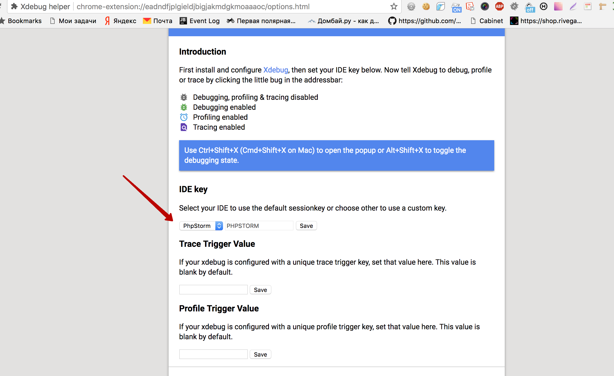
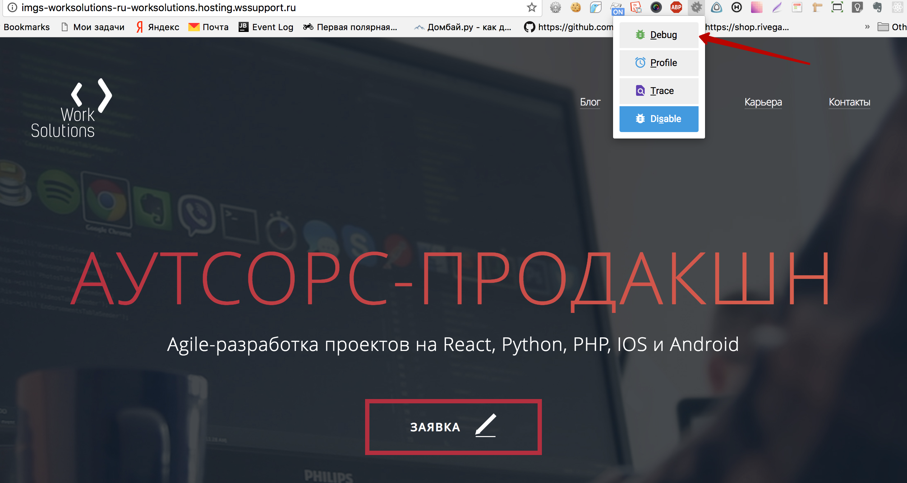

Настройка xdebug
==========================

## Настройка в PHPStorm
1. Открыть настройки.
2. В поиске вбить "xdebug" и выбрать Debug.

3. Задать настройки xdebug. 

    - Debug Port:  порт который указан в конфиге php для расширения xdebug. 
    - Can accept external connections: необходимо установить если проект находится не на локальной машине, а на удаленном сервере.
    
## Установка расшрения в Google Chrome  
- Установить [плагин](https://chrome.google.com/webstore/detail/xdebug-helper/eadndfjplgieldjbigjakmdgkmoaaaoc?hl=ru)
- Перейти в настройки плагина и указать в настройках плагина в поле Ide Key - PhpStorm.


 
## Отладка удаленного сайта

- Для отладки удаленного сайта нужны следующие данные:
    - доступы по ssh: <хост>, <порт>, <пользователь>, <пароль> 
    - `<server xdebug port>`
- Настроить PHPStorm как указано в первом разделе, указав Debug Port `<local xdebug port>`, номер порта вы можете выбрать по своему усмотрению.
- В терминале выполнить следующую команду:
```
ssh -R <server xdebug port>:localhost:<local xdebug port> <пользователь>@<хост> -p<порт>
```
- В PHPStorm включить прослушивание, нажав на иконку телефона "Start listening for PHP debug connections"
- В браузере в плагине включить режим xdebug(см. второй раздел). 
